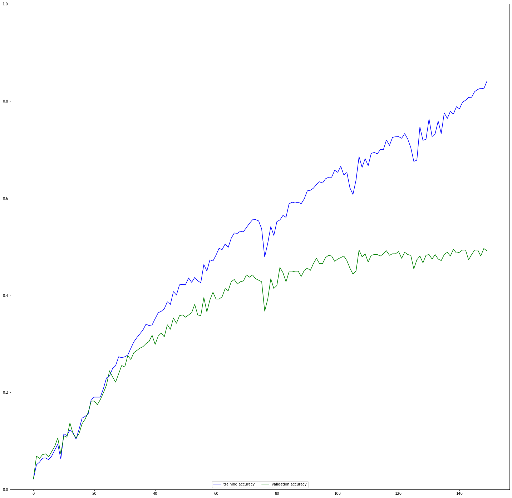
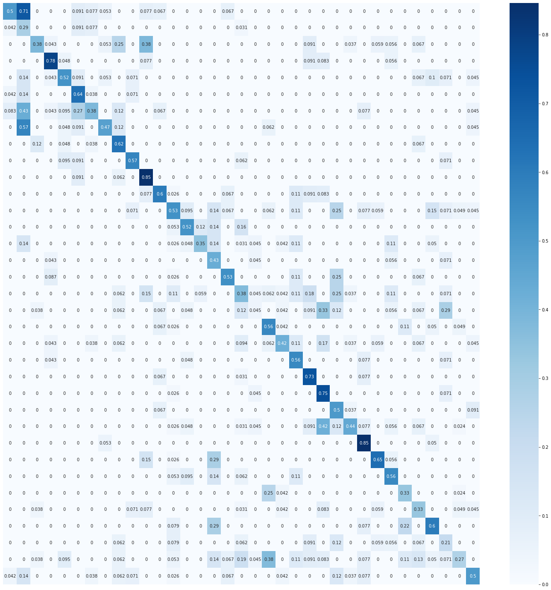
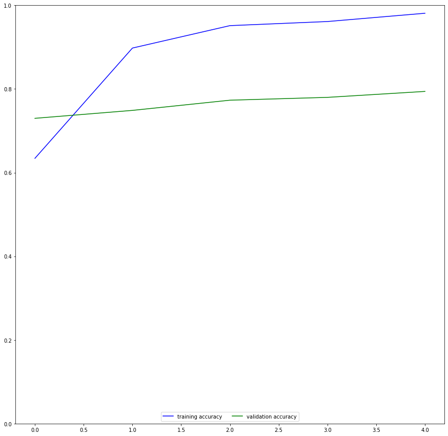
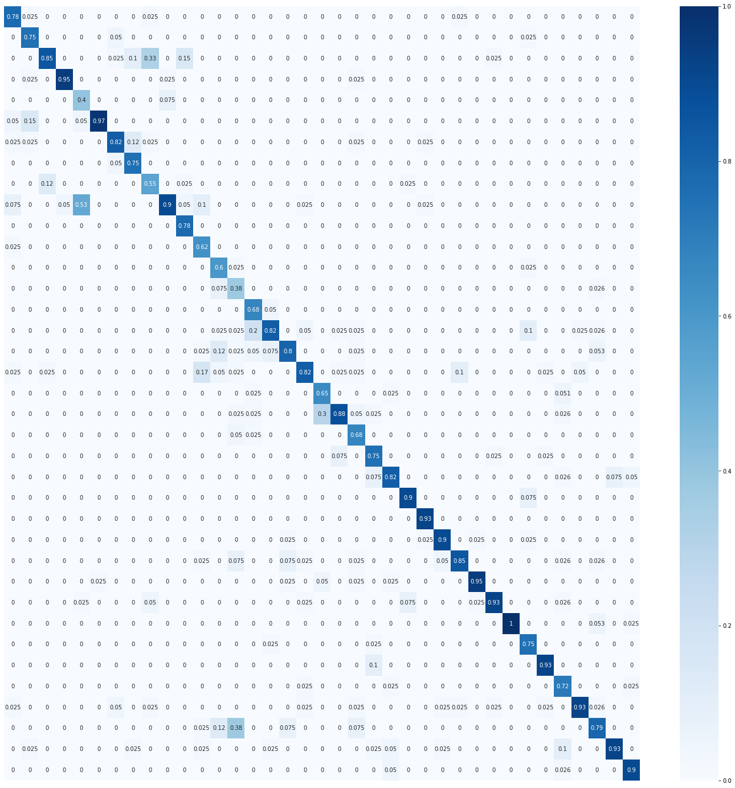
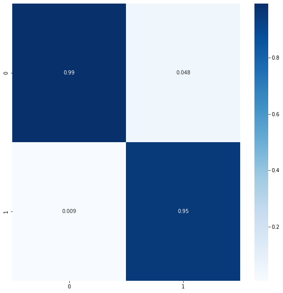
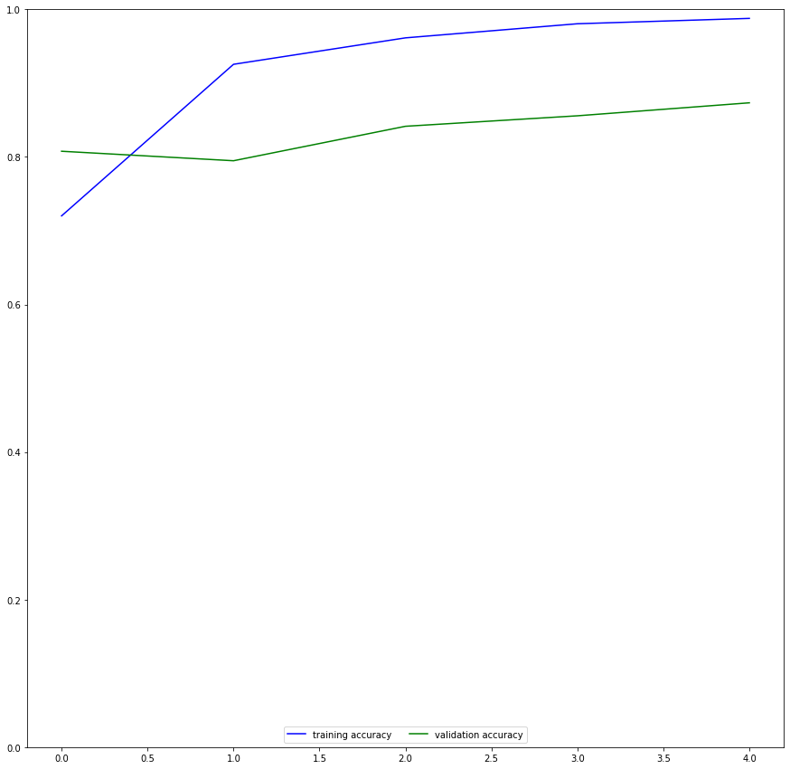
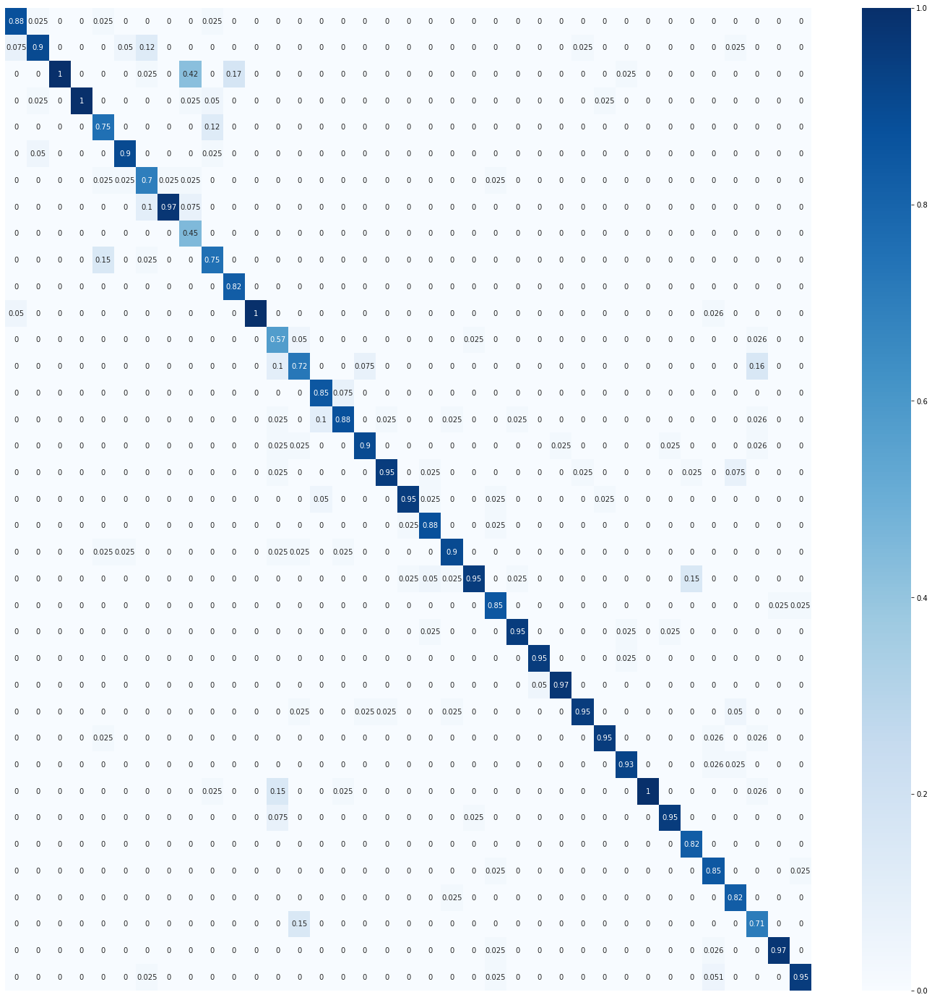
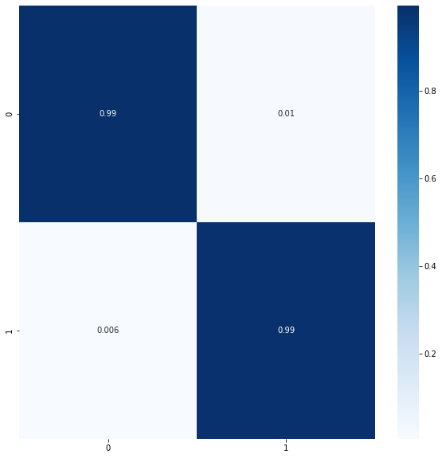

# Convolutional neural networks for determining breeds of cats and dogs.


Consists of three neural networks. The first is completely created and trained from scratch on Pytorch. The other two are built on TenserFlow by retraining the last layers of the VGG-19 and ResNet networks. The accuracy of the first network is 48%, the second and third are 79% and 87%, respectively.


## First model: Pet Face classification

### Model

After downloading, reading and normalizing the data, I moved on to creating a partition on PyTorch.

I created a model from 4 convolutional layers that collapse the image (50,50,3) to 256 features, and then the line layer determines the class based on these features

```
class Net(nn.Module):
    def __init__(self):
        super(Net, self).__init__()
        self.l1 = nn.Sequential(nn.Conv2d(3, 32, 5),nn.ReLU(), nn.MaxPool2d(kernel_size=2,stride = 2)) 
        self.l2 = nn.Sequential( nn.Conv2d(32, 64,5),nn.ReLU(), nn.MaxPool2d(kernel_size=2,stride = 2))
        self.l3 = nn.Sequential( nn.Conv2d(64, 128,4),nn.ReLU(), nn.MaxPool2d(kernel_size=2,stride = 2))
        self.l4 = nn.Conv2d(128,256, 3)
        self.l5 = nn.Flatten()
        self.l6 = nn.Linear(256, 35)
    def forward(self, x):
        x = self.l1(x)
        x = self.l2(x)
        x = self.l3(x)
        x = self.l4(x)
        x = self.l5(x)
        x = self.l6(x)
        return x
net = Net()
criterion = nn.CrossEntropyLoss()
optimizer = torch.optim.Adam(net.parameters(),lr= 0.001)
```

After 150 epochs of network training, we got this result.

### Training schedule



### Accuracy

```
Classification accuracy: 0.48522550544323484
Classification cat and dog accuracy: 0.9035769828926905
```

### Сonfusion matrix by breed



### Confusion matrix to determine "Cats vs Dogs"


### Top-3 accuracy

```
Accuracy cat_Siamese: 0.8461538461538461
Accuracy dog_pomeranian: 0.8461538461538461
Accuracy cat_Bombay: 0.782608695652174
```

## Second and third models: Full image classification with transfer learning

## VGG

Let's download the pretrained vgg19 model without line layers, turn off convolutional training and create our own line layer for 37 classes.

```
vgg = keras.applications.vgg19.VGG19(weights = 'imagenet', include_top = False,input_shape=(224,224,3))
for i in vgg.layers:
    i.trainable = False

model = keras.models.Sequential()
model.add(tf.keras.layers.Lambda(tf.keras.applications.vgg19.preprocess_input)) 
model.add(vgg)
model.add(Flatten())
model.add(Dense(37,activation='softmax'))
model.compile(optimizer='rmsprop',loss='categorical_crossentropy',metrics=['accuracy'])
```

After 5 epochs, we got the accuracy:

```
Train accuracy: 0.981058657169342
Test accuracy: 0.7941774129867554
```

### Training schedule



### Сonfusion matrix



### Classification accuracy of Cats from Dogs

```
Classification cat and dog accuracy vgg: 0.9783344617467841
```



### Top-5 accuracy

```
Accuracy pug: 1.0
Accuracy Egyptian_Mau: 0.975
Accuracy Bombay: 0.95
Accuracy newfoundland: 0.95
Accuracy keeshond: 0.925
```

## ResNet

Let's make a similar model using the pre-trained ResNet model

```
resnet = keras.applications.resnet.ResNet152(weights = 'imagenet', include_top = False,input_shape=(224,224,3))
for i in resnet.layers:
    i.trainable = False

model2 = keras.models.Sequential()
model2.add(tf.keras.layers.Lambda(tf.keras.applications.resnet.preprocess_input)) 
model2.add(resnet)
model2.add(Flatten())
model2.add(Dense(37,activation='softmax'))
model2.compile(optimizer='rmsprop',loss='categorical_crossentropy',metrics=['accuracy'])
```

After 5 training epochs

```
Train accuracy: 0.9878234267234802
Test accuracy: 0.8733919858932495
```

### Training schedule



### Сonfusion matrix



### Classification accuracy of Cats from Dogs

```
Classification cat and dog accuracy vgg: 0.992552471225457
```



### Top-5 accuracy

```
Accuracy Birman: 1.0
Accuracy Bombay: 1.0
Accuracy Sphynx: 1.0
Accuracy pug: 1.0
Accuracy Persian: 0.975
```

As we can see, using pretrained networks, in tasks where this is possible, you can get a much better result in less time.